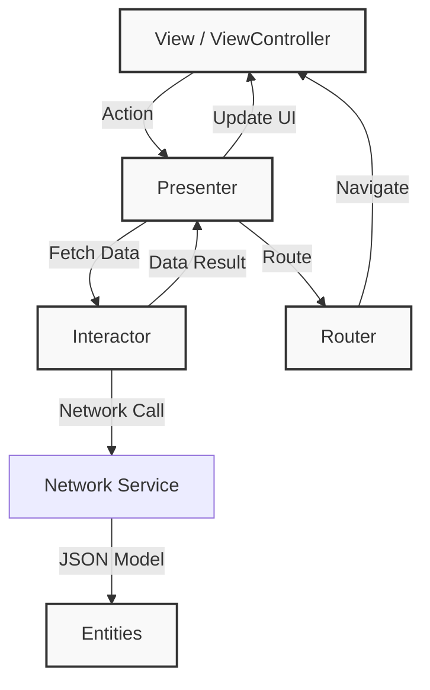

# NewsApp — iOS News Reader with Japanese Aesthetics

---

**Автор:** Прахов Данил, БПИ246  
**Дисциплина:** НИС "Основы iOS-разработки" (Домашнее задание №5)  
**Дата:** 11 февраля 2026 г.  

---

## Описание проекта

**NewsApp (dprakhovPW5)** — это новостной агрегатор для iOS, разработанный с акцентом на уникальный пользовательский опыт и визуальный стиль. Приложение отходит от стандартных системных компонентов в пользу кастомной дизайн-системы, вдохновленной японской эстетикой.

Ключевой особенностью является внедрение собственной дизайн-системы **JapaneseDesign**, которая включает в себя процедурную генерацию узоров (Seigaiha), специальные цветовые палитры (#8F76E8, #F5F5F0) и интерактивные анимации.

Архитектурно приложение построено на паттерне **VIPER**, что обеспечивает чистое разделение ответственности, тестируемость и масштабируемость кода.

---

## Архитектура системы (VIPER)

Приложение следует принципам **Clean Architecture** с использованием паттерна VIPER. Каждый экран (модуль) состоит из пяти компонентов:



### Основные компоненты модулей

| Компонент | Роль | Примеры в коде |
|-----------|------|---------------|
| **View** | Отображение UI, анимации, передача действий | `NewsListViewController`, `Cell` |
| **Interactor** | Бизнес-логика, работа с сетью, фильтрация данных | `NewsListInteractor` |
| **Presenter** | Связующее звено, подготовка данных для View | `NewsListPresenter` |
| **Entity** | Модели данных (DTO) | `ArticleModel`, `NewsPage` |
| **Router** | Навигация и переходы между экранами | `NewsListRouter` |

---

## Ключевые возможности и UI/UX

### Дизайн-система (Japanese Design System)
- **Уникальная палитра**: Используются традиционные японские цвета (#8F76E8, #E63946, #F5F5F0).
- **Процедурные узоры**: Фон приложения генерируется кодом (CoreGraphics) в виде узора *Seigaiha* (волны).
- **Кастомная навигация**: Вместо стандартного `UINavigationBar` используется собственный полупрозрачный хедер с размытием.

### "Плавающий остров" (Floating Island)
Уникальный элемент навигации в нижней части экрана, объединяющий основные действия:
- **Обновление ленты**: С анимацией вращения.
- **Фильтр "Япония"**: Мгновенно фильтрует новости на клиенте, оставляя только связанные с Японией.
- **Случайная статья**: Переход к случайной новости (Dice roll).

### Анимации и микровзаимодействия
- **Loading State**: Анимированный "Прыгающий кот" (Maneki Neko) при загрузке.
- **Empty State**: Контекстные сообщения ("Вестей пока нет..." vs "Новостей про Японию пока нет...") с парящим котом.
- **Haptic Feedback**: Тактильная отдача при нажатии на кнопки острова.
- **Spring Animations**: Пружинная анимация появления ячеек при скролле.

### Работа с сетью
- Загрузка новостей с пагинацией (infinite scrolling).
- Обработка изображений и кэширование (через системные механизмы).
- Поддержка Deep Linking для открытия полных версий статей.

---

## Технологический стек

| Категория | Технологии |
|-----------|------------|
| **Язык** | Swift 5.10 |
| **UI Framework** | UIKit (Programmatic UI, Auto Layout) |
| **Архитектура** | VIPER |
| **Сеть** | URLSession, Codable |
| **Графика** | CoreGraphics (Custom Drawing), CoreAnimation |
| **Асинхронность** | GCD (Grand Central Dispatch) |

---

## Структура проекта

```
dprakhovPW5/
├── App/                        # Делегат приложения и настройки сцены
├── Helpers/                    # Утилиты и расширения
│   └── DesignSystem.swift      # Ядро дизайн-системы (цвета, шрифты, компоненты)
├── Models/                     # Модели данных (ArticleModel)
├── Modules/                    # VIPER модули
│   ├── NewsList/               # Экран списка новостей
│   │   ├── Assembly, Interactor, Presenter, etc.
│   │   └── View/Cell           # UI компоненты экрана
│   └── NewsStory/              # Экран просмотра новости (WebView)
├── Services/                   # Сервисный слой
│   └── NewsNetworkService.swift # Сетевой клиент
└── Resources/                  # Ассеты и иконки
```

---

## Инструкция по запуску

### Требования
- **Xcode 15.0+**
- **iOS 15.0+**

### Шаги
1. Откройте файл проекта `.xcodeproj` в Xcode.
2. Дождитесь индексации проекта.
3. Выберите симулятор (рекомендуется iPhone 17 Pro).
4. Нажмите `Cmd + R` для запуска.

> **Примечание:** 
> - Запускайте приложение **без VPN**, чтобы проверить основной функционал (загрузка новостей).
> - Запускайте **c VPN**, если хотите увидеть Empty State анимацию (эмуляция отсутствия связи или доступа).

---

## Контакты

**Автор:** Прахов Данил  
**Email:** danilla9082@gmail.com  
**GitHub:** [@danilprakh0v](https://github.com/danilprakh0v)  
**Telegram:** [@kirayoshikag](https://t.me/kirayoshikag)
